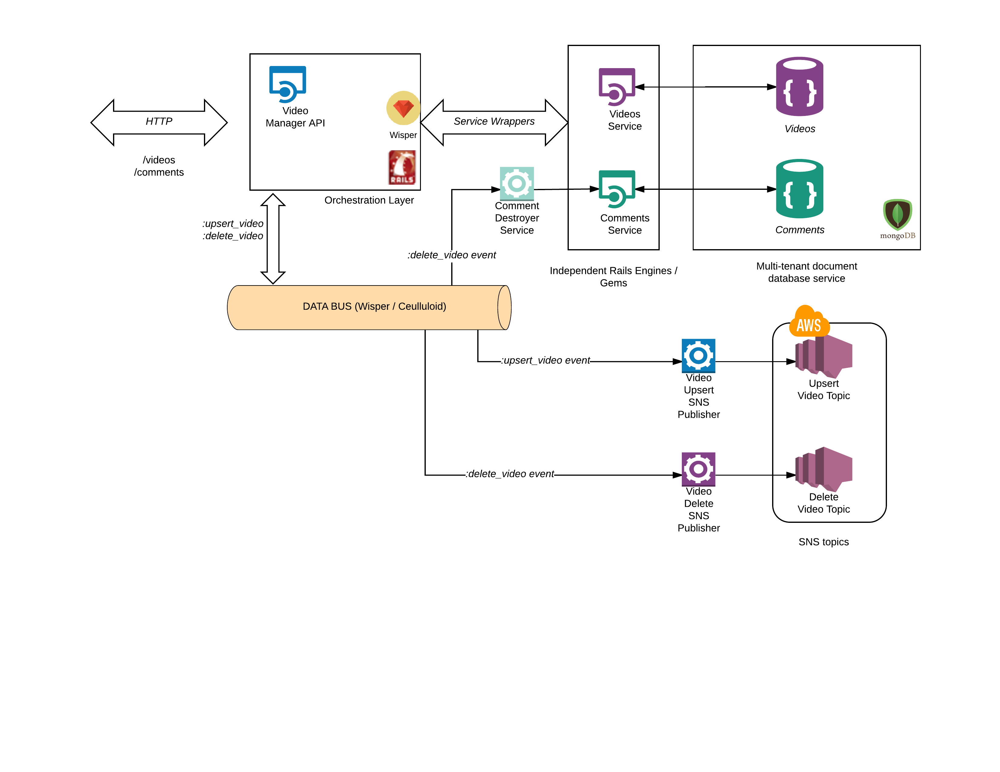

# Video Manager API

[](https://app.getpostman.com/run-collection/f4b5fce6b058ac5f6b92#?env%5BDevelopment%5D=W3siZW5hYmxlZCI6dHJ1ZSwia2V5IjoiaG9zdCIsInZhbHVlIjoibG9jYWxob3N0OjMwMDAiLCJ0eXBlIjoidGV4dCJ9LHsiZW5hYmxlZCI6dHJ1ZSwia2V5IjoidmlkZW9faWQiLCJ2YWx1ZSI6IjlmMDQ1N2ZhLTI1YTctNDgwZS04NjdhLTkxNjVlODk4MDNiYyIsInR5cGUiOiJ0ZXh0In0seyJlbmFibGVkIjp0cnVlLCJrZXkiOiJjb21tZW50ZXJfaWQiLCJ2YWx1ZSI6ImU5ZWQ5MmE3LWRjOTAtNGZkNy04ZTFjLTdlZmJlMDU5MDc2YiIsInR5cGUiOiJ0ZXh0In0seyJlbmFibGVkIjp0cnVlLCJrZXkiOiJjb21tZW50X2lkIiwidmFsdWUiOiI3MzJmYTU4Zi1lNWNmLTQ5MmYtYjBmOS00ZmIwMjc1NjAwNGUiLCJ0eXBlIjoidGV4dCJ9XQ==)
[](https://app.getpostman.com/run-collection/b584f718eea00c872836#?env%5BDevelopment%5D=W3siZW5hYmxlZCI6dHJ1ZSwia2V5IjoiaG9zdCIsInZhbHVlIjoibG9jYWxob3N0OjMwMDAiLCJ0eXBlIjoidGV4dCJ9LHsiZW5hYmxlZCI6dHJ1ZSwia2V5IjoidmlkZW9faWQiLCJ2YWx1ZSI6IjlmMDQ1N2ZhLTI1YTctNDgwZS04NjdhLTkxNjVlODk4MDNiYyIsInR5cGUiOiJ0ZXh0In0seyJlbmFibGVkIjp0cnVlLCJrZXkiOiJjb21tZW50ZXJfaWQiLCJ2YWx1ZSI6ImU5ZWQ5MmE3LWRjOTAtNGZkNy04ZTFjLTdlZmJlMDU5MDc2YiIsInR5cGUiOiJ0ZXh0In0seyJlbmFibGVkIjp0cnVlLCJrZXkiOiJjb21tZW50X2lkIiwidmFsdWUiOiI3MzJmYTU4Zi1lNWNmLTQ5MmYtYjBmOS00ZmIwMjc1NjAwNGUiLCJ0eXBlIjoidGV4dCJ9XQ==)

This is a proof of concept for implementing
micro-services, event-driven and multi-tentant database architectures (and even eventually-consisten)
in a single app.

It is ideal for proofing distributed architectures, on a manageable sandbox,
prior to deciding to provision-out all components.

When the time comes to separate components into separate apps, it can be done
with minimum effort, since all parts are written around clearly defined domain boundaries.

## Pre-requisites
You must have Ruby, and MongoDb. You will also need docker if you want to use the dockerized features

## Installation
Clone this repo. Then:

```bash
$ bundle
```

## Running tests

to run all main app and engine tests do:

```bash
make test_native
```

or you can do `rspec` for each individual repo

## Configuration

### Database
The api persists data to MongoDb. Database configs are kept on the `./config/mongoid.yml` file.
Under the `clients` section, you must define one client per service and in turn the
databse used by that client. In this case, we have `comments` and `videos` services
using a separate database each (under the same dbService instance) like so:

```yml
  clients:
    videos:
      database: videos_development
      hosts:
        - <%= ENV.fetch('MONGODB_HOST', 'localhost') %>:27017
    comments:
      database: comments_development
      hosts:
        - <%= ENV.fetch('MONGODB_HOST', 'localhost') %>:27017
```

DB Hosts default to localhost. You can change them by setting:

| Variable                    |Description                            |
|-----------------------------|---------------------------------------|
|MONGODB_HOST                 | ip / url of mongo host                |

### Running a server

For development run:

```bash
$ rails s
```

For production, pass the `RAILS_ENV` variable

```bash
RAILS_ENV=production rails s
```

### SNS topics
The app publishes to 2 SNS topics:
- a video upsert topic (for all video crates and updates)
- a video delete topic (for all video deletes)

setup these env variables

| Variable                    |Description                            |
|-----------------------------|---------------------------------------|
|AWS_REGION                   | aws region (default us-east-1)        |
|AWS_KEY                      | your aws key                          |
|AWS_SECRET                   | your aws secret                       |
|UPSERT_VIDEO_SNS_TOPIC_ARN   | upsert sns topic arn                  |
|DELETE_VIDEO_SNS_TOPIC_ARN   | delete sns topic arn                  |

## API endpoints
The API manages 2 resources (check links to Postman docs):
 - [Videos](https://documenter.getpostman.com/view/2688065/videos/6tc242P)
 - [Comments for those Videos](https://documenter.getpostman.com/view/2688065/comments/6tc242R)

There's also a `/healthy/all.json` endpoint for synthetic monitoring and [health checks](https://documenter.getpostman.com/view/2688065/health-checks/6tc242Q)

### Videos:
Get a Video

```json
GET  /videos/:video_id
```

response

```json
{
    "_id": "b950550a-e75e-488f-a770-fbffa7b0dbf5",
    "title": "hello",
    "description": "world",
    "updated_at": "2017-09-06T01:25:42.190Z",
    "created_at": "2017-09-06T01:25:42.190Z"
}
```

Create a Video

```json
POST  /videos

{
	"video" : {
		"title" : "shoo fly!",
		"description" : "don't bother me!"
	}
}
```

Update a Video

```json
PUT  /videos/:video_id

{
	"video" : {
		"description" : "foo bar baz"
	}
}
```

Delete a Video

**note: All comments associated with the video will also be deleted!!**

```json
DELETE /videos/:video_id
```

### Comments:
Get a Comment

```json
GET  /comment/:comment_id
```

response

```json
{
    "_id": "c8872f3f-4e57-44c3-9efa-4761260374dc",
    "video_id": "b950550a-e75e-488f-a770-fbffa7b0dbf5",
    "commenter_id": "d27b2b56-abb3-43f1-aef7-dfba9c838cef",
    "text": "Awesome Video Dude!!!",
    "updated_at": "2017-09-12T00:04:59.221Z",
    "created_at": "2017-09-12T00:04:59.221Z"
}
```

Create a Comment

```json
POST  /comments

{
	"comment" : {
		"video_id" : "b950550a-e75e-488f-a770-fbffa7b0dbf5",
		"commenter_id" : "d27b2b56-abb3-43f1-aef7-dfba9c838cef",
		"text" : "Awesome Video Dude!!!"
	}
}
```

Update a Comment

```json
PUT  /comments/:comment_id

{
	"comment" : {
		"text" : "Can't get enough of this video!!!"
	}
}
```

Delete a Comment

```json
DELETE /comments/:comment_id
```

Get all comments for a video

```json
GET /comments?video_id=b950550a-e75e-488f-a770-fbffa7b0dbf5
```

## Architecture
Here's a diagram depicting an overview of the architecure:



The architecture is based on crating clearly defined domain boundaries.
The main API acts as an orchestration and composition layer. It manages all of the http requests and in turn
calls the individual data services (in this case videos and comments) using service wrappers.

Data Transactions generate events that are published to a data bus (implemented around the [wisper gem](https://github.com/krisleech/wisper)
Data Services are subscribed to the bus and react to different events.
For this proof of concept there are 2 SNS publishers that subscribe to the `:upsert_video` and `:delete_video`
events which in turn publish to the corresponding AWS SNS topics.

To maintain referential integrity, there is a `comments_destroyer` service that subscribes to the
`:delete_video` event and in turn deletes all comments for the video that was deleted.

### Data Services:
The `videos` and `comments` services are implemented around self_contained rails engines,
and are referenced as gems in the Gemfile. They are bare-bones CRUD implementations, that persist
to document databases. The later allow persisting data in the format as the representation being served.

This creates a clear isolation of boundaries with no cross-concerns between the orchestration layer
and the discrete services.

Each service persists to a [mongoDb](https://www.mongodb.com/) database. In this example,
Both the `videos` and `comments` databases are hosted on the same mongo instance.

As explained previously (on the comments destroyer service), the data bus allows implementing discrete data services, for cross-cutting concerns.

This organization allows for a clear separation of responsibilities. It facilitates a very easy transition
to discrete applications with their own infrastructure, since all implementations have been done
around clearly defined boundaries.

This architecture also facilitates implementing new data representations (for new endpoints) by using
eventual consistent and CQRS databases, eliminating the need to implement complex business rules
and convoluted data transformations.

### Data Bus:
The [wisper](https://github.com/krisleech/wisper) gem provides a very straightforward implementation of
pub-sub patterns.
It can even be expanded to use [sidekiq](https://github.com/krisleech/wisper-sidekiq)
This allows a straight path to separating the subscribed services from the main app

## Project Organization
The project at ./video_manager is the REST api. The services orchestrated by the main app are
found under `./app/services`

### Data Services
```
./video_manager
-- /app/services
---- comments_service.rb
---- video_service.rb
---- video_upsert_sns_publisher.rb
---- video_delete_sns_publisher.rb
```

### Rails Engines
The individual services (rails engines) codebase is found under `./services` under root:

```
./video_manager
-- /services
---- /videos
---- /comments
```

### Data Bus
Subscriptions are configured on the `wisper.rb` file under `./config/initializers`

```ruby
Wisper.subscribe(VideoUpsertSnsPublisher.new, async: true, prefix: :on)
Wisper.subscribe(VideoDeleteSnsPublisher.new, async: true, prefix: :on)
Wisper.subscribe(CommentsDestroyer.new, async: true, prefix: :on)
```

## Docker

The whole project is dockerized. You can run specs or a server.
Make sure your docker daemon is running locally

### build images

```bash
$ make build
```

### run tests

```bash
$ make test
```

### run a server

```bash
$ make run
```

Then lookup your docker machine's ip

```bash
$ docker-machine ip

192.168.99.100
```

... and issue calls against that ip

```bash
$ curl http://192.168.99.100:3000/health/all.json
```